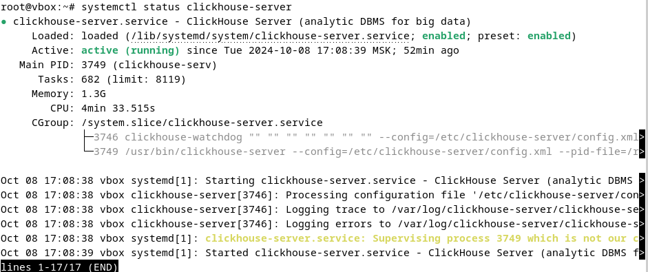
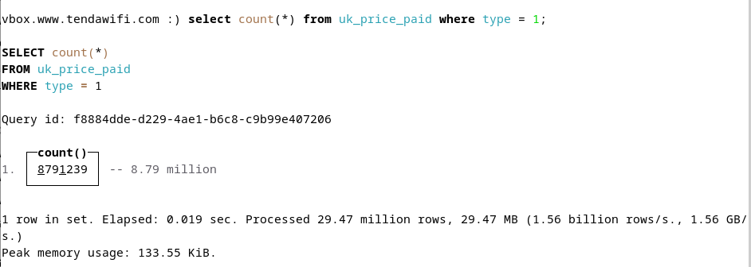
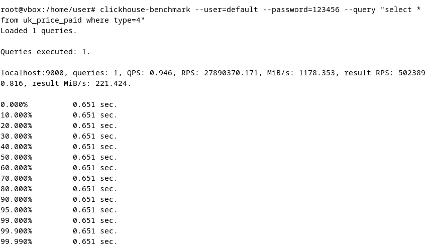
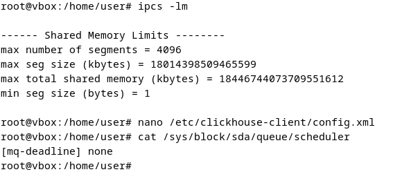
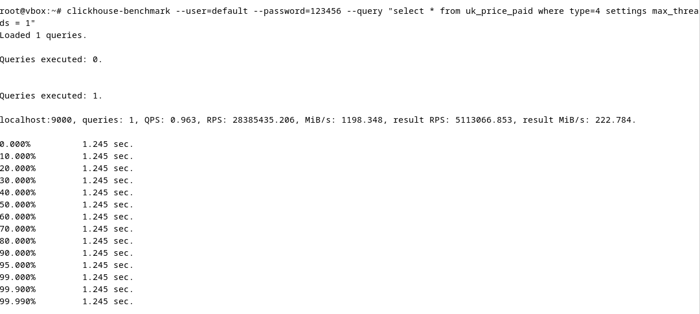

# Описание/Пошаговая инструкция выполнения домашнего задания:
* Установить ClickHouse.
* Подгрузить датасет для примера и сделать селект из таблицы.
* Для проверки отправить скрины работающего инстанса ClickHouse, созданной виртуальной машины и результата запроса select count() from trips where payment_type = 1.
* Провести тестирование производительности и сохранить результаты;
* Изучить конфигурационные файлы БД;
* Произвести наиболее оптимальную настройку системы на основании характеристик вашей ОС и провести повторное тестирование;
* Подготовить отчет касательно прироста/изменения производительности системы на основе проведенных настроек.
* Результатом выполнения работы является подготовленный отчет в формате pdf, в котором указано описание всех выполненных пунктов. Поощряется работа в отдельных гит-репозиториях
  
# Решение

## Установка + загрузка датасета (UK Property Price Paid dataset)




## Настройки

### Первый тест до всех настроек



### Затем
* Отключены THP
* Лимиты для root подняты до 100000
* Планировщик по умолчанию стоит mq-deadline
* kernel.shmmax = 18446744073692774399
* overcommit_memory = 0



### Для экономии оперативной памяти (для случаев где ее меньше 16Гб)

```
<max_block_size>8192</max_block_size> в profile для default
<mark_cache_size replace="1">65536000</mark_cache_size> config.d/settings.conf
```

Можно еще уменьшить кол-во потоков
SETTINGS max_threads = 1
SETTINGS max_download_threads = 1
SETTINGS input_format_parallel_parsing = 0
SETTINGS output_format_parallel_formatting = 0
65536000



Но при данных настройках сейчас нет влияния, тесты показывают более низкую скорость а RAM и так и так хватает пока.
